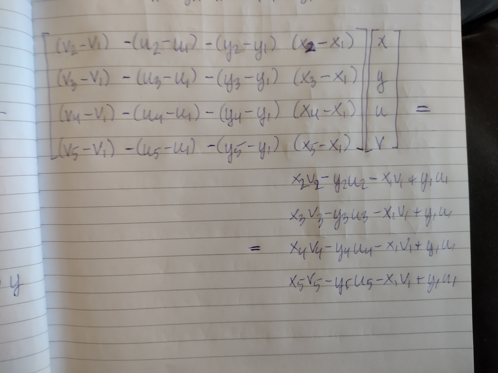

# Day24: Never Tell Me The Odds

[Day 24: Never Tell Me The Odds](https://adventofcode.com/2023/day/24)

## Part 2

Call position and velocity of where you need to be and how fast you need to throw $(x, y, z)$ and $(u, v, w)$ respectively.
Call position and velocity of the nth given hailstone $(x_n, y_n, z_n)$ and $(u_n, v_n, z_n)$. Call the time of intersection
between the rock and the nth hailstone $t_n$. Ignore the 3rd dimension for now, that is focus on $(x, y), (u, v), (x_n, y_n)$ and $(u_n, v_n)$.

The following equations holds for $x, y, u$ and $v$:

